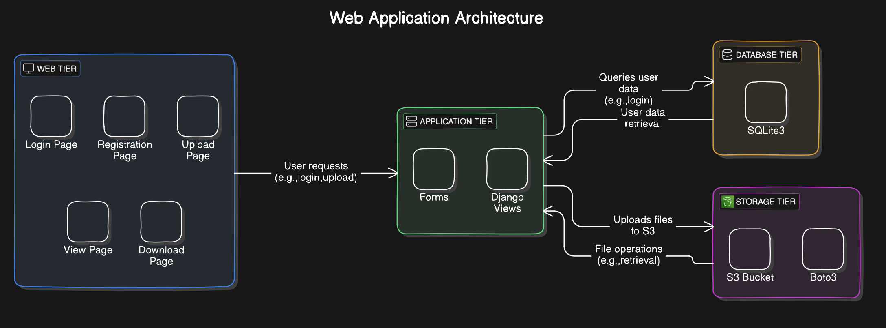

# Cloud Drive Application Documentation

## Overview

The Cloud Drive application is a Django-based project designed for document management, utilizing AWS S3 for cloud storage. The application supports user registration, login, document upload, viewing, and deletion.


## Table of Contents
- [Application Features](#application-features)
- [Setup and Configuration](#setup-and-configuration)
- [Running the Application](#running-the-application)
- [URL Endpoints](#url-endpoints)
- [Functionality Description](#functionality-description)
- [AWS S3 Integration](#aws-s3-integration)
- [Dependencies](#dependencies)
- [Installation Instructions](#installation-instructions)

## Application Features

- **User Registration and Authentication**: Allows users to register, login, and logout.
- **Document Management**: Users can upload documents to AWS S3, view a list of their documents, delete documents, and download documents.

## Setup and Configuration

### Prerequisites
- Python 3.8 or later
- AWS Account and S3 Bucket
- Boto3 and Django Storages Library

### Environment Setup
## Dependencies

List of Python packages required for the project as specified in the `requirements.txt`:

- asgiref==3.8.1
- boto3==1.35.43
- botocore==1.35.43
- Django==5.1.2
- django-storages==1.14.4
- jmespath==1.0.1
- python-dateutil==2.9.0.post0
- python-dotenv==1.0.1
- s3transfer==0.10.3
- six==1.16.0
- sqlparse==0.5.1
- urllib3==2.2.3

## Installation Instructions

1. To install these dependencies, navigate to the project directory in your terminal and run the following command:

    ```bash
    pip install -r requirements.txt
    ```

    This command will automatically install all the packages listed in the `requirements.txt` file along with their dependencies.

2. **Configure AWS Credentials**:
   Store your AWS credentials in an environment file `.env` located at `5517/myproject/myproject/aws_secrets.env`. This should contain:
   ```
   AWS_ACCESS_KEY_ID=your_access_key
   AWS_SECRET_ACCESS_KEY=your_secret_key
   ```

3. **Update `settings.py`**:
   Ensure the settings for AWS S3 in `settings.py` match your AWS configuration, especially `AWS_STORAGE_BUCKET_NAME` and `AWS_S3_REGION_NAME`.

## Running the Application

1. **Set Up the Database**:
   Run migrations to set up your database schema:
   ```bash
   python manage.py migrate
   ```

2. **Create Superuser**:
   Create an administrative user to access the Django admin:
   ```bash
   python manage.py createsuperuser
   ```

3. **Run the Server**:
   Start the development server on your local machine:
   ```bash
   python manage.py runserver
   ```
   This will start the server on `http://127.0.0.1:8000/` by default.

## URL Endpoints

| Endpoint               | Functionality                          |
|------------------------|----------------------------------------|
| `/register/`           | User registration page                 |
| `/upload/`             | Document upload form                   |
| `/view/`               | View list of uploaded documents        |
| `/logout/`             | Logout the current user                |
| `/delete/<str:key>/`   | Delete a specific document             |
| `/serve/<str:filename>/` | Download a specific document          |

## Functionality Description

### User Management
- **Register**: Uses `RegisterForm` to create a new user. Automatically logs in the user post-registration.
- **Logout**: Terminates the user session and redirects to the home page.

### Forms Management
* **UploadFileForm**: This form is used for uploading files. It contains a single FileField without any validators or custom labels, but you can add these features as needed for more control over the file upload process.
* **RegisterForm**: This form extends Django's UserCreationForm and is used for user registration. It includes an additional email field which is marked as required. The form modifies the save method to include the email address in the user model.
    * **Fields Included**:
        * Username
        * Email
        * Password1(Password)
        * Password2(Password Confirmation)
    * **Functionality**:
        * The email is extracted from the cleaned data of the form and set into the user model before saving.
        * If commit is True, the user is saved to the database.
### Document Management
- **Upload**: Validates and uploads files to AWS S3. Captures and reports on the upload status.
- **View**: Lists all documents stored in S3, displaying metadata such as name, size, and last modified date.
- **Delete**: Removes files from S3 and updates the user interface accordingly.
- **Serve/Download**: Provides direct downloading capabilities for files stored in S3, handling permissions and errors.

## AWS S3 Integration

- Utilizes Boto3 to interact with AWS S3 for file storage operations.
- Configures Django Storages to handle static and media files in S3, setting up appropriate URLs and paths for accessing these resources.


